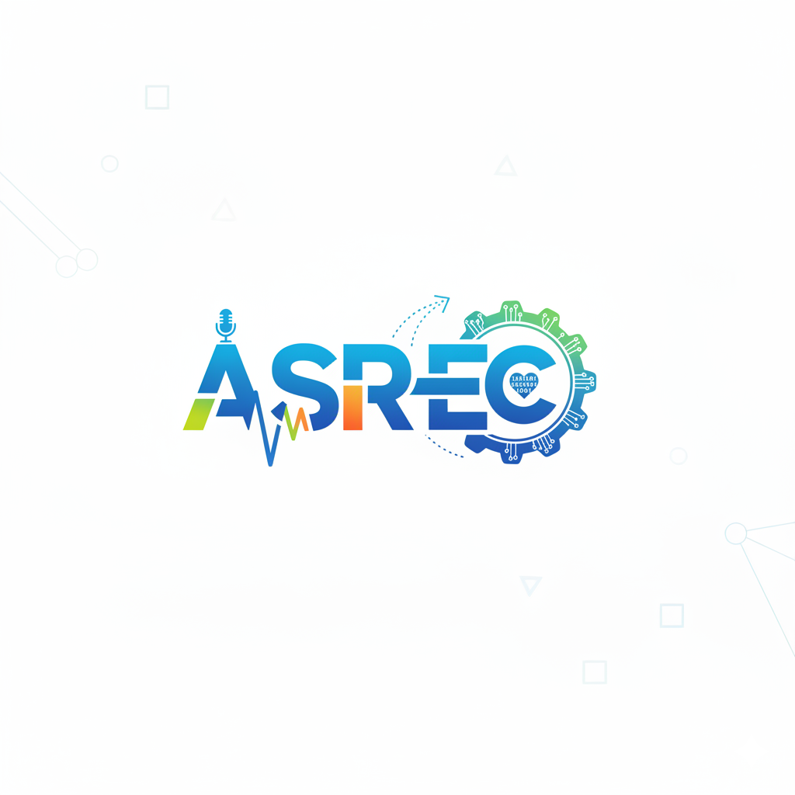

<p align="center">
  <a href="https://arxiv.org/abs/2412.03075">
    
  </a>
</p>


<p align="center">
  <em> ASR-EC Benchmark: Evaluating Large Language Models on Chinese ASR Error Correction</em>
</p>

<p align="center"><strong>[&nbsp;<a href="https://arxiv.org/abs/2412.03075">Read the Paper</a>&nbsp;]</strong></p>

## 📰 Overview
Automatic Speech Recognition (ASR) is a fundamental and important task in the field of speech and natural language processing. In recent years, it is still inevitable for modern ASR systems to have a substantial number of erroneous recognition due to environmental noise, ambiguity, etc. Therefore, we study ASR error correction in the Chinese language, which is one of the most popular languages and enjoys a large number of users in the world. We first create a benchmark dataset named ASR-EC that contains a wide spectrum of ASR errors generated by industry-grade ASR systems. To the best of our knowledge, it is the first Chinese ASR error correction benchmark. Then, inspired by the recent advances in large language models (LLMs), we investigate how to harness the power of LLMs to correct ASR errors. We apply LLMs to ASR error correction in three paradigms. The first paradigm is prompting, which is further categorized as zero-shot, few-shot, and multi-step. The second paradigm is finetuning, which finetunes LLMs with ASR error correction data. The third paradigm is multi-modal augmentation, which collectively utilizes the audio and ASR transcripts for error correction. Extensive experiments reveal that prompting is not effective for ASR error correction. Finetuning is effective only for a portion of LLMs. Multi-modal augmentation is the most effective method for error correction and achieves state-of-the-art performance.

**📅 Sep 25, 2025**: The paper has been accepted to **EMNLP 2025**!  

## 🚀 Dataset.
The training and testing dataset can be found in the train_data and test_data folders, respectively. 

## 🚀 Contributions.
We warmly welcome collaboration from the broader NLP, Machine Learning, and Education communities. Whether it’s improving our methods, expanding the dataset, or exploring new evaluation directions, we’re eager to work together to push this project further. 

For any discussions or inquiries, please reach out to [Victor Junqiu Wei](https://sites.google.com/view/victor-junqiu-wei) at wjqjsnj@gmail.com.

## 📂 Citation

If you find our work helpful, please use the following citations.

```bibtex
@inproceedings{wei2025asr,
    title={ASR-EC Benchmark: Evaluating Large Language Models on Chinese ASR Error Correction},
    author={Victor Junqiu Wei and Weicheng Wang and Di Jiang and Yuanfeng Song and Lu Wang},
    booktitle={The 2025 Conference on Empirical Methods in Natural Language Processing},
    year={2025},
}
```
